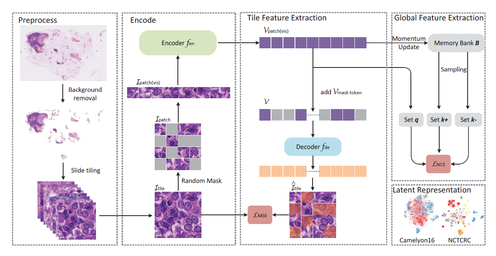

# GCMAE

<p align="center">
  
</p>

The official implementation of the paper [Global Contrast Masked Autoencoders Are Powerful Pathological Representation Learners](https://arxiv.org/abs/2205.09048)

```
@article{li2022gcmae,
  author = {Quan, Hao and Li, Xingyu and Chen, Weixing and Bai, Qun and Zou, Mingchen and Yang, Ruijie and Zheng, Tingting and Qi, Ruiqun and Gao, Xinghua and Cui, Xiaoyu},
  title = {Global Contrast Masked Autoencoders Are Powerful Pathological Representation Learners},
  journal={arXiv:2205.09048},
  year = {2022},
}
```
## Abstract
Based on digital whole slide scanning technique, artificial intelligence algorithms represented by deep learning have achieved remarkable results in the field of computational pathology. Compared with other medical images such as Computed Tomography (CT) or Magnetic Resonance Imaging (MRI), pathological images are more difficult to annotate, thus there is an extreme lack of data sets that can be used for supervised learning. In this study, a self-supervised learning (SSL) model, Global Contrast Masked Autoencoders (GCMAE), is proposed, which has the ability to represent both global and local domain-specific features of whole slide image (WSI), as well as excellent cross-data transfer ability. The Camelyon16 and NCTCRC datasets are used to evaluate the performance of our model. When dealing with transfer learning tasks with different data sets, the experimental results show that GCMAE has better linear classification accuracy than MAE, which can reach **81.10%** and **89.22%** respectively. Our method outperforms the previous state of-the-art algorithm and even surpass supervised learning (improved by **3.86%** on NCTCRC data sets).

## Installation
This repo is a modification on the [mae repo](https://github.com/facebookresearch/mae). Installation and preparation follow that repo.

## Usage

* [PRETRAIN](PRETRAIN.md)

* [LINPROBE](LINPROBE.md)

* [FINETUNE](FINETUNE.md)

* [ Visual GCMAE feature representation](VISUAL.md)

## Dataset
  * [Camelyon16](https://pan.baidu.com/s/1N0fqJR9u8yq-y6ZY0mSoUw?pwd=noms)
  * [NCT-CRC-HE-100K](https://zenodo.org/record/1214456)
  * [BreakHis](https://web.inf.ufpr.br/vri/databases/breast-cancer-histopathological-database-breakhis/)

## License
Distributed under the CC-BY-NC 4.0 License. See [LICENSE](LICENSE) for more information.
